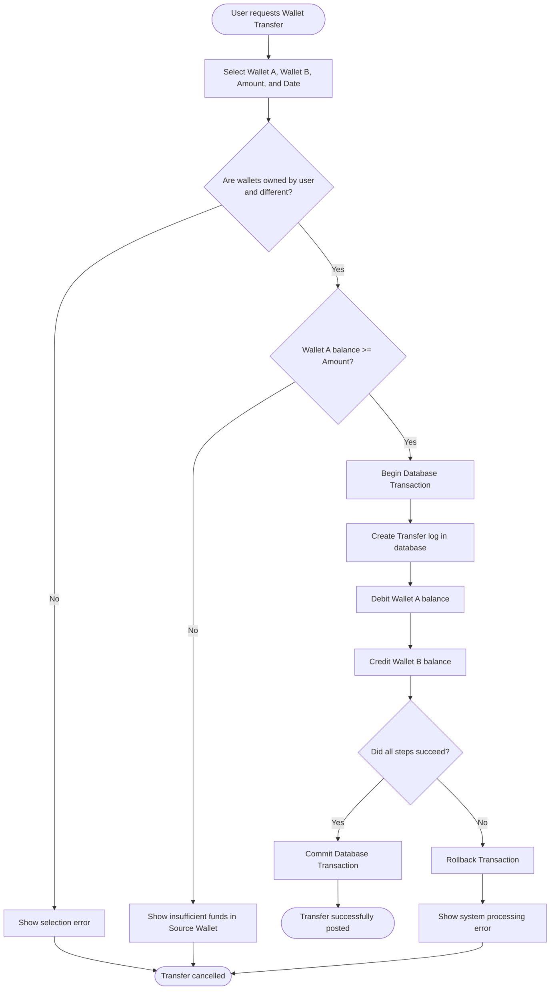
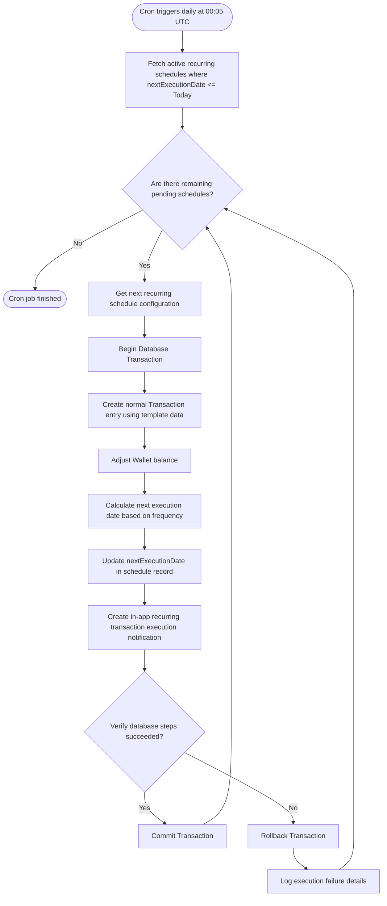

# System Diagrams - MoneyMate

This document presents the visual models for **MoneyMate** using Mermaid diagrams, explaining the Use Cases and key Activity flows.

---

## 1. Use Case Diagram

The diagram below outlines the interactions between the **Authenticated User** (Actor), the **System Chron Engine** (Background Actor), and the system use cases.

```mermaid
usecaseDiagram
    actor User as "Authenticated User"
    actor Cron as "System Cron Engine"

    User --> (Register / Login / Logout)
    User --> (Manage Wallets)
    User --> (Transfer Funds Between Wallets)
    User --> (Manage Custom Categories)
    User --> (Record Transaction)
    User --> (Filter / Search Transactions)
    User --> (Set Category Budget)
    User --> (Manage Saving Goals)
    User --> (Setup Recurring Schedule)
    User --> (View Dashboard & Charts)
    User --> (Upload Receipt / OCR)
    User --> (Query AI Advisor)

    Cron --> (Auto-Generate Recurring Transactions)
    Cron --> (Evaluate Budgets & Trigger Alerts)
```

---

## 2. Activity Diagrams

### 2.1 Expense Recording Flow
This activity diagram details the flow when a user creates an expense transaction.

```mermaid
flowchart TD
    Start([User starts recording transaction]) --> Input[Input Amount, Wallet, Category, Date, and Note]
    Input --> Validate{Is inputs valid? \n (Amount > 0?)}
    Validate -- No --> Error[Show validation errors] --> Input
    Validate -- Yes --> CheckBalance{Wallet Type == CREDIT_CARD \n OR Wallet Balance >= Amount?}
    
    CheckBalance -- Yes --> Save[Write Transaction to DB]
    CheckBalance -- No --> Overdraft{Allow Overdraft?}
    Overdraft -- Yes --> Save
    Overdraft -- No --> ErrorBalance[Show insufficient balance error] --> Stop([Cancel transaction])

    Save --> UpdateBalance[Recalculate Wallet Balance]
    UpdateBalance --> EvaluateBudget{Is Category Budget \n defined for this month?}
    
    EvaluateBudget -- No --> Finish([Transaction saved successfully])
    EvaluateBudget -- Yes --> CheckThreshold{Expenses >= 80% of Budget?}
    
    CheckThreshold -- No --> Finish
    CheckThreshold -- Yes --> Check100{Expenses >= 100% of Budget?}
    
    Check100 -- No --> Trigger80Alert[Trigger 80% Warning Notification] --> Finish
    Check100 -- Yes --> Trigger100Alert[Trigger 100% Limit Alert Notification] --> Finish
```

### 2.2 Inter-Wallet Transfer Flow
This activity diagram details the atomic process of moving funds from Wallet A to Wallet B.



### 2.3 Automated Recurring Transaction Cron Flow
This activity diagram details how the background engine automatically spawns transaction entries for scheduled bills.


