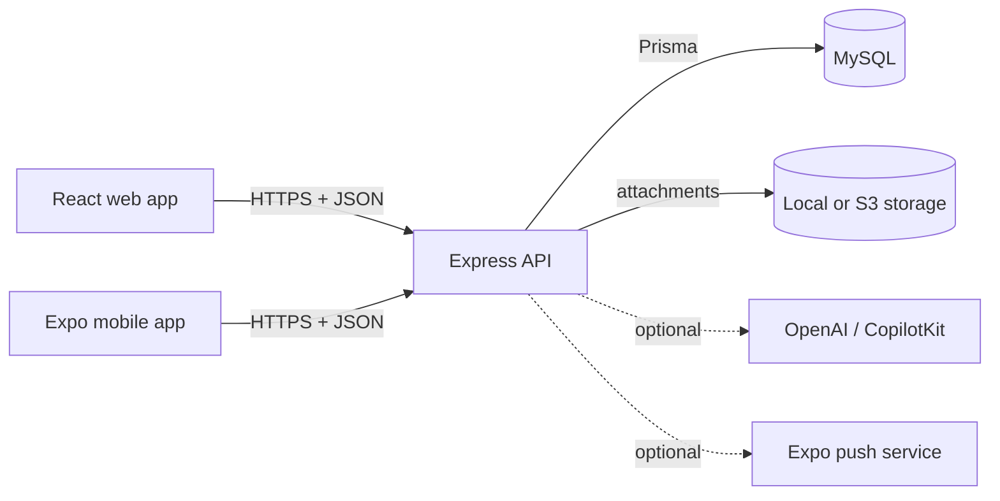
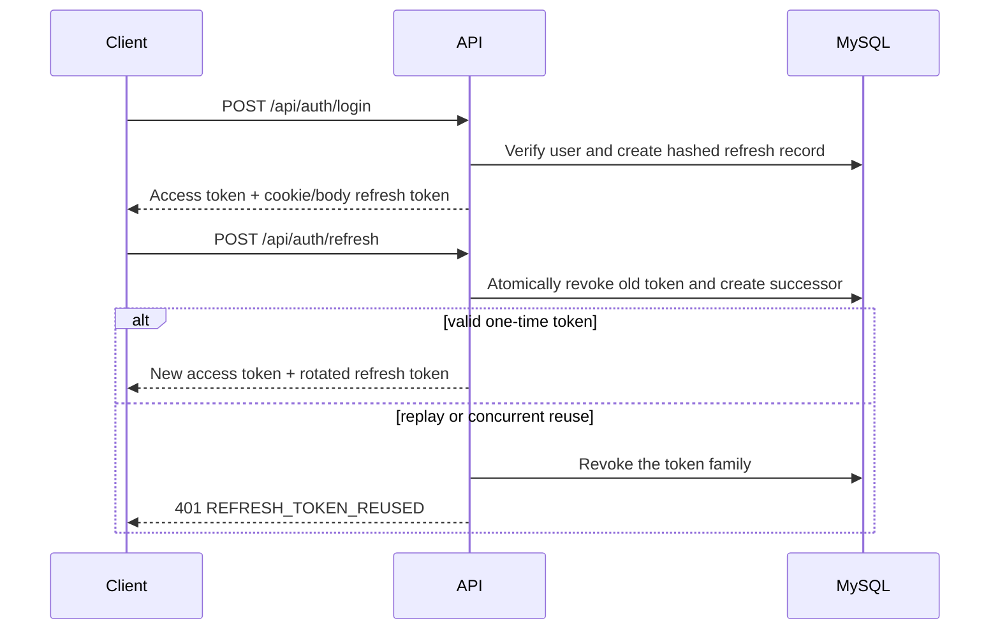
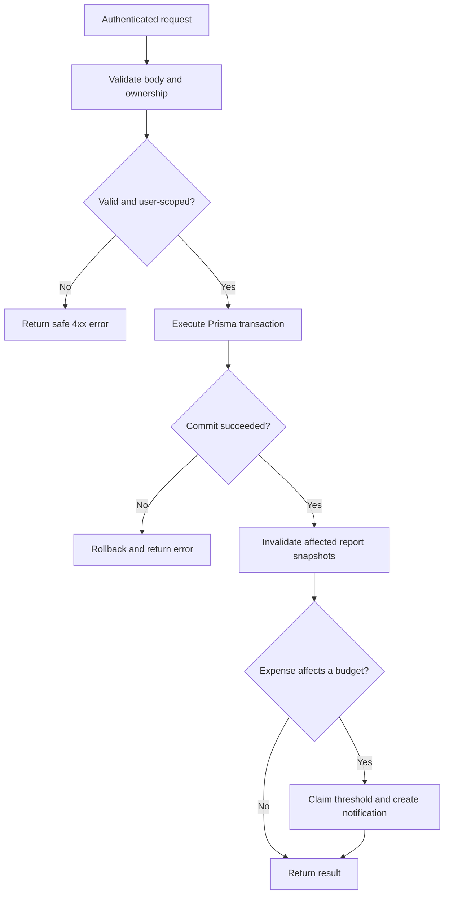
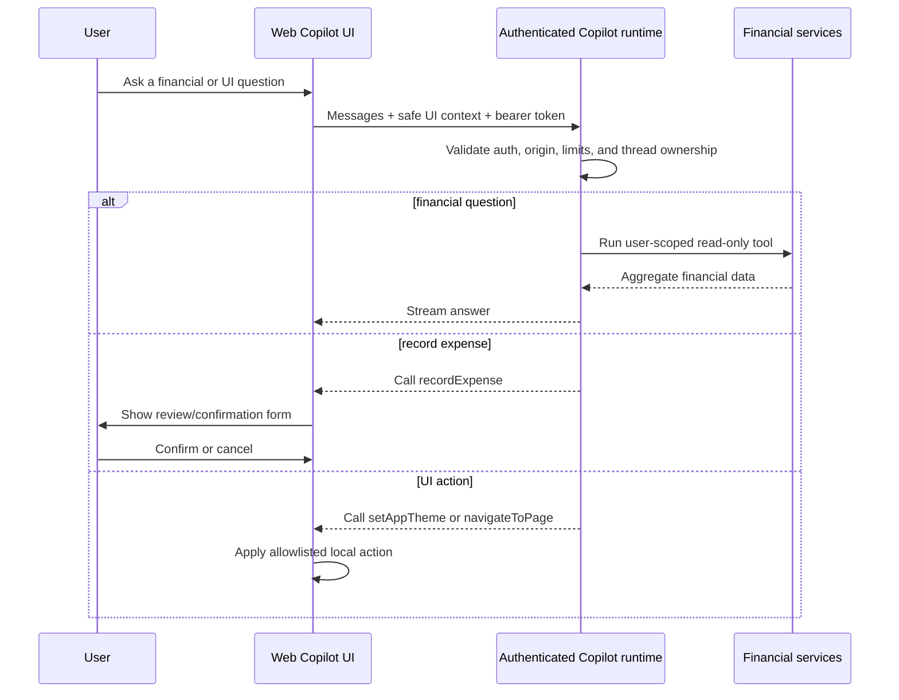
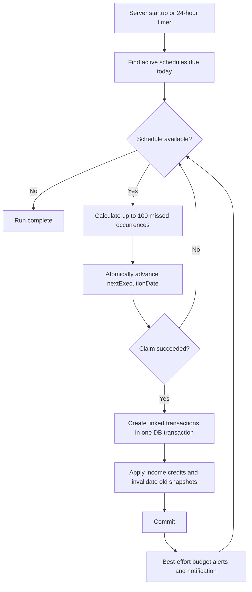
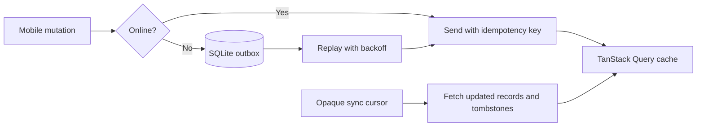

# MoneyMate System Diagrams

> Implementation reference, verified against the repository on 2026-09-24.

## System context

## Authentication and token rotation

## Financial mutation

## Copilot interaction

## Recurring transaction processing

## Mobile offline synchronization

