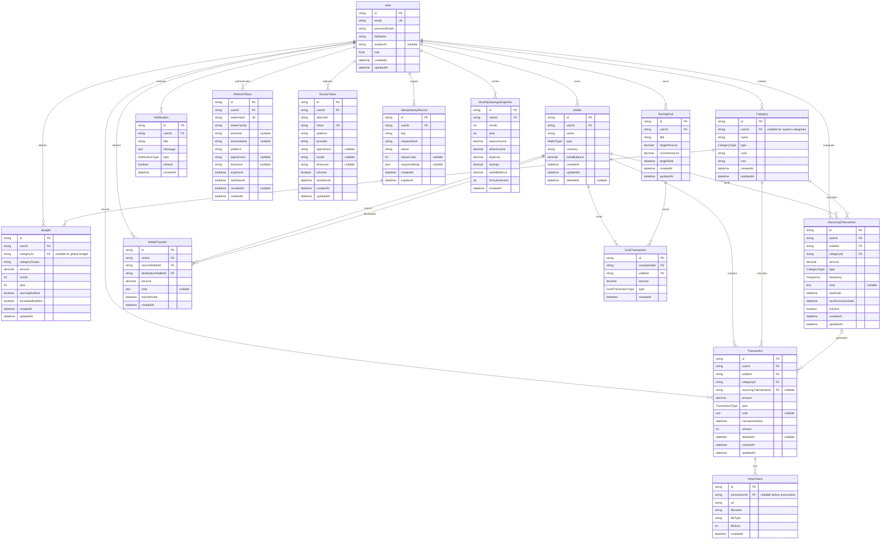

# MoneyMate Entity Relationship Model

> Derived from `backend/prisma/schema.prisma`, verified on 2026-09-24. The Prisma schema and migrations are authoritative.

## Entity relationship diagram

## Enumerations

| Enum | Values |
| --- | --- |
| `Role` | `USER`, `ADMIN` |
| `WalletType` | `CASH`, `BANK`, `CREDIT_CARD`, `E_WALLET`, `SAVING` |
| `CategoryType` | `INCOME`, `EXPENSE` |
| `TransactionType` | `INCOME`, `EXPENSE`, `TRANSFER` |
| `GoalTransactionType` | `DEPOSIT`, `WITHDRAW` |
| `Frequency` | `DAILY`, `WEEKLY`, `MONTHLY`, `YEARLY` |
| `NotificationType` | `BUDGET_ALERT`, `BILL_REMINDER`, `GOAL_COMPLETED`, `RECURRING_TRANSACTION` |

## Key constraints and indexes

### Ownership and deletion

- Deleting a `User` cascades through directly owned relational data.
- `Wallet` and `Transaction` use nullable `deletedAt` timestamps for soft deletion.
- Transactions restrict wallet/category deletion at the database relation level.
- Attachments cascade when their associated transaction row is physically deleted.
- A recurring source on a generated transaction is nullable and becomes `NULL` if the schedule is deleted.

### Uniqueness

- User email is globally unique.
- Custom/system category identity is constrained by `(userId, name, type)`.
- A budget is unique by `(userId, categoryScope, month, year)`; `categoryScope` normalizes global versus category scope for MySQL uniqueness.
- Monthly snapshots are unique by `(userId, month, year)`.
- Refresh-token hashes and push-provider tokens are globally unique.
- Device registration is unique by `(userId, deviceId, provider)`.
- Idempotency keys are unique per user.

### Operational indexes

- Wallets: `(userId, deletedAt)`.
- Transactions: `(userId, updatedAt)`, `(userId, deletedAt, transactionDate)`, and `(recurringTransactionId, transactionDate)`.
- Recurring schedules: `(isActive, nextExecutionDate)`.
- Refresh sessions: `(userId, revokedAt)` and `tokenFamily`.
- Device tokens: `(userId, isActive)`.
- Idempotency records: `expiresAt`.

## Data semantics

- Monetary columns use `Decimal(15,2)`.
- VND is the default wallet currency, but the wallet schema stores a currency string.
- The field named `Wallet.initialBalance` currently stores the mutable wallet amount used by income, transfer, and savings-goal operations; the name is retained for migration compatibility.
- Expense transactions are reporting records in the current service behavior and do not decrement that stored wallet amount.
- `Transaction.version` and `deletedAt` support optimistic concurrency and mobile tombstone synchronization.
- `Budget.warningNotified` and `exceededNotified` prevent duplicate threshold notifications.
- `MonthlySavingsSnapshot.formulaVersion` supports invalidating/recomputing historical formulas.
- `IdempotencyRecord.requestHash` prevents reuse of the same key with a different request body.

## Migration policy

Schema changes must be introduced through new Prisma migrations. Production deployments use `prisma migrate deploy`; they must never use `migrate reset`. Destructive or large-table migrations require a tested backup/restore and a forward-fix plan.
