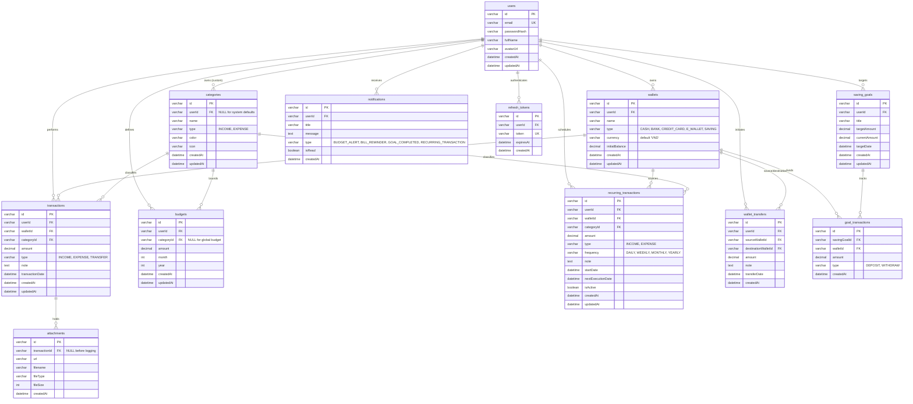

# Entity Relationship Diagram & Schema Specifications - MoneyMate

This document specifies the database structure, data types, and relationships for the **MoneyMate** Personal Finance Management System.

---

## 1. Entity Relationship Diagram (ERD)

The diagram below represents the tables and their relations.

---

## 2. Table Specifications

### 2.1 users
Stores registered user credentials and profile information.
- `id`: `VARCHAR(36)` - Primary Key (UUID).
- `email`: `VARCHAR(191)` - Unique key, user email for authentication.
- `passwordHash`: `VARCHAR(255)` - Bcrypt hashed password.
- `fullName`: `VARCHAR(255)` - User's display name.
- `avatarUrl`: `VARCHAR(255)` - URL/path to stored avatar image.
- `createdAt` / `updatedAt`: `DATETIME(3)`.

### 2.2 wallets
Tracks balances across individual funding sources.
- `id`: `VARCHAR(36)` - Primary Key (UUID).
- `userId`: `VARCHAR(36)` - Foreign Key referencing `users(id)` ON DELETE CASCADE.
- `name`: `VARCHAR(255)` - Custom name of the wallet (e.g., Momo, ATM VCB).
- `type`: `ENUM('CASH', 'BANK', 'CREDIT_CARD', 'E_WALLET', 'SAVING')`.
- `currency`: `VARCHAR(10)` - Default 'VND'.
- `initialBalance`: `DECIMAL(15, 2)` - Starting balance at wallet creation.
- `createdAt` / `updatedAt`: `DATETIME(3)`.

### 2.3 categories
Classifies transactions into income and expense categories.
- `id`: `VARCHAR(36)` - Primary Key (UUID).
- `userId`: `VARCHAR(36)` - Foreign Key referencing `users(id)`. NULL represents system-wide default categories.
- `name`: `VARCHAR(255)` - Name of category.
- `type`: `ENUM('INCOME', 'EXPENSE')`.
- `color`: `VARCHAR(7)` - Color hex code for UI display.
- `icon`: `VARCHAR(50)` - Lucide/FontAwesome icon key name.
- @@unique([`userId`, `name`, `type`]) - Enforces category name uniqueness per user per category type.

### 2.4 transactions
Main ledger for all physical cash movements (income and expenses).
- `id`: `VARCHAR(36)` - Primary Key (UUID).
- `userId`: `VARCHAR(36)` - Foreign Key referencing `users(id)` ON DELETE CASCADE.
- `walletId`: `VARCHAR(36)` - Foreign Key referencing `wallets(id)` ON DELETE RESTRICT.
- `categoryId`: `VARCHAR(36)` - Foreign Key referencing `categories(id)` ON DELETE RESTRICT.
- `amount`: `DECIMAL(15, 2)` - positive financial amount.
- `type`: `ENUM('INCOME', 'EXPENSE', 'TRANSFER')`.
- `note`: `TEXT` - Optional note.
- `transactionDate`: `DATETIME(3)` - Timestamp when transaction occurred.

### 2.5 budgets
Defines monthly spending caps.
- `id`: `VARCHAR(36)` - Primary Key (UUID).
- `userId`: `VARCHAR(36)` - Foreign Key referencing `users(id)` ON DELETE CASCADE.
- `categoryId`: `VARCHAR(36)` - Foreign Key referencing `categories(id)` ON DELETE CASCADE. NULL means global monthly budget.
- `amount`: `DECIMAL(15, 2)` - Total monthly limit.
- `month` / `year`: `INT` - Calendar tracking parameters.
- @@unique([`userId`, `categoryId`, `month`, `year`]) - Limit category to one budget target per month.

### 2.6 saving_goals & goal_transactions
Saving Goals are target metrics. Goal Transactions capture deposits/withdrawals.
- **saving_goals**:
  - `id`: `VARCHAR(36)` - Primary Key (UUID).
  - `userId`: `VARCHAR(36)` - Foreign Key referencing `users(id)` ON DELETE CASCADE.
  - `title`: `VARCHAR(255)` - E.g., "Build Gaming PC".
  - `targetAmount`: `DECIMAL(15, 2)`.
  - `currentAmount`: `DECIMAL(15, 2)` - Updated automatically by goal transactions.
  - `targetDate`: `DATETIME(3)`.
- **goal_transactions**:
  - `id`: `VARCHAR(36)` - Primary Key.
  - `savingGoalId`: `VARCHAR(36)` - Foreign Key referencing `saving_goals(id)` ON DELETE CASCADE.
  - `walletId`: `VARCHAR(36)` - Foreign Key referencing `wallets(id)` ON DELETE RESTRICT (source/target wallet).
  - `amount`: `DECIMAL(15, 2)`.
  - `type`: `ENUM('DEPOSIT', 'WITHDRAW')`.

### 2.7 recurring_transactions
Templates for automated bills, subscriptions, or recurring salaries.
- `id`: `VARCHAR(36)` - Primary Key (UUID).
- `userId`: `VARCHAR(36)` - Foreign Key referencing `users(id)` ON DELETE CASCADE.
- `walletId`: `VARCHAR(36)` - Foreign Key referencing `wallets(id)` ON DELETE RESTRICT.
- `categoryId`: `VARCHAR(36)` - Foreign Key referencing `categories(id)` ON DELETE RESTRICT.
- `amount`: `DECIMAL(15, 2)`.
- `type`: `ENUM('INCOME', 'EXPENSE')`.
- `frequency`: `ENUM('DAILY', 'WEEKLY', 'MONTHLY', 'YEARLY')`.
- `startDate` / `nextExecutionDate`: `DATETIME(3)`.
- `isActive`: `BOOLEAN` - Set to `true` by default.

### 2.8 notifications
Stores system warnings and activity alerts.
- `id`: `VARCHAR(36)` - Primary Key.
- `userId`: `VARCHAR(36)` - Foreign Key referencing `users(id)` ON DELETE CASCADE.
- `title`: `VARCHAR(255)`.
- `message`: `TEXT`.
- `type`: `ENUM('BUDGET_ALERT', 'BILL_REMINDER', 'GOAL_COMPLETED', 'RECURRING_TRANSACTION')`.
- `isRead`: `BOOLEAN` - default false.

### 2.9 refresh_tokens
Authenticates session renewals securely.
- `id`: `VARCHAR(36)` - Primary Key.
- `userId`: `VARCHAR(36)` - Foreign Key referencing `users(id)` ON DELETE CASCADE.
- `token`: `VARCHAR(255)` - Unique token signature.
- `expiresAt` / `createdAt`: `DATETIME(3)`.

### 2.10 wallet_transfers
Records the source-destination logs of multi-wallet transfers.
- `id`: `VARCHAR(36)` - Primary Key (UUID).
- `userId`: `VARCHAR(36)` - Foreign Key referencing `users(id)` ON DELETE CASCADE.
- `sourceWalletId`: `VARCHAR(36)` - Foreign Key referencing `wallets(id)` ON DELETE RESTRICT.
- `destinationWalletId`: `VARCHAR(36)` - Foreign Key referencing `wallets(id)` ON DELETE RESTRICT.
- `amount`: `DECIMAL(15, 2)`.
- `transferDate`: `DATETIME(3)`.

### 2.11 attachments
Receipt image files linked to transactional expenses.
- `id`: `VARCHAR(36)` - Primary Key.
- `transactionId`: `VARCHAR(36)` - Foreign Key referencing `transactions(id)` ON DELETE CASCADE (nullable).
- `url` / `filename` / `fileType`: `VARCHAR`.
- `fileSize`: `INT`.
